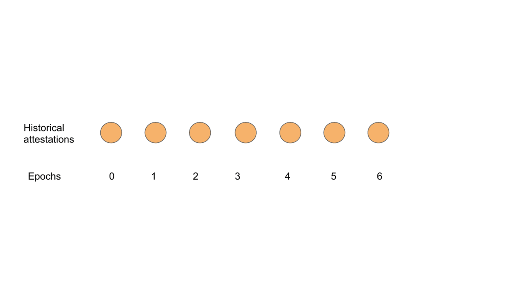

# attestation_slashing_protection
Small PoC to protect a validator client from signing slashable attestations. Please read https://hackmd.io/u8MTIe5IRmybzVz38-sGdQ for more context.

## Algorithm
Here's the idea:
  1. For every target epoch higher than the `new_attestation` target epoch, check that the corresponding source epoch is higher than the `new_attestation` source epoch (checking that `new_attestation` is not surrounded by any previous vote).
  2. If the `new_attestation` target epoch is already in the historical attestation list, check that they have the same hash (checking for double votes).
  3. For every target epoch between the `new_attestation` source epoch and the `new_attestation` target epoch, check that the corresponding source epoch is smaller than the `new_attestation` source epoch (checking we're not surrounding any previous votes).

By taking advantage of the fact that the attestation_history is already sorted, this algorithm should be near instantaneous in almost all normal cases. The complexity is a linear function of the number of target epochs in the attestation_history that are bigger than the `current_attestation.source.epoch`.
Here's a gif to visualize it better:

## Running tests
There are two PoC in this repo. The first is a Rust version and the second a Python version.
The Python version needs revision, and tests are lousy.
To run Rust tests:

`cd rust_poc; cargo test`

To run Python tests:
`cd python_poc; python3 tests.py`
